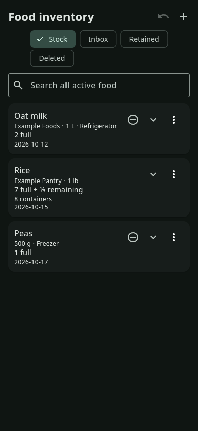
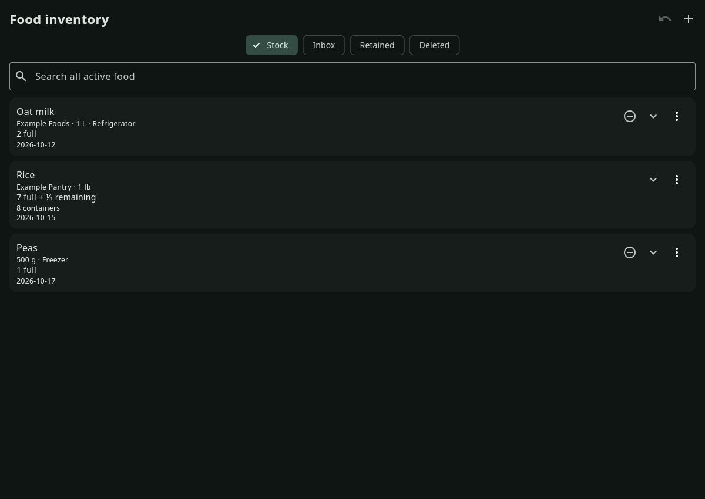

# Food inventory: early working preview

This checkpoint starts the approved food implementation on stable2026.10.3
(`530b458845288856ffa3bc91a671e7bc9a43ff12`, documentation head above released
source `76c5dd5cb7eedb09d2d4b62f737d429e1abab7d9`). It is a synthetic,
process-local preview for early layout review, not a release candidate.
No profile, sync folder or private import is opened. Layout is not frozen.

## Actual preview

| Narrow stock | Wide stock |
| --- | --- |
|  |  |

- [Inspect individual containers](narrow-inspect.png) and [select the partial container](narrow-selected-partial.png).
- [Explicit Deleted and Restore](narrow-deleted.png).
- [Initially collapsed retention](narrow-retained-collapsed.png) and [expanded retained stock](narrow-retained-expanded.png).
- [Needs-expiration Inbox](narrow-inbox.png) and [Add food editor](narrow-editor.png).
- [Scripted native Linux demo with visible pointer](native-linux-scripted-preview.mp4).

All accepted screenshots are actual Flutter GTK debug rendering on an isolated
Linux Xvfb display, dark theme, at the named pixel dimensions. Phone-width Linux
is not Android. The demo scripts Flutter taps while moving the actual X pointer
to each input; it is not a physical-device touch attestation. The initial native
test splash capture is excluded from accepted evidence and preserved in the
private scratch run. No compiled production artifact acceptance is claimed.

## Implemented first slice

Physical IDs survive observed-target removal/Restore and reordered or duplicate
delivery. Count is derived; seven full plus one third-full container remain
eight containers. Grouping includes descriptive fields and exact expiry, with
global expiry order. Quick Remove one appears only for identical full stock;
partial stock requires inspection and selection. Concurrent contents alternatives
remain visible, and Restore does not cancel an unseen deletion.

Undated food stays in Inbox. Retention hides ordinary stock and uses the shared
tag input, with initially collapsed reason sections. Active all-term search
bypasses normal filters; Deleted search is explicit. New reason drafts survive
Save, composing text is protected, and deleting a newly staged chip does not
reintroduce its text. Bounded batches preserve a captured group larger than one
command, including session Undo. Dialog decisions are one-shot; editor-owned
inputs are disposed after route completion.

## Validation, reviews and remaining work

`manifest.json` binds source, images, demo and logs. The focused tests cover
physical identity, concurrency, deletion ordering, validation, draft safety and
narrow/wide rendering. The actual Linux integration flow inspects a partial
container, removes that exact ID, restores it, checks retention, opens Inbox and
the editor, then returns to stock. Independent reviews under `reviews/` preserve
their original scope and source bindings; earlier findings and closure records
must be read together.

Open gates: authoritative food codec/stream admission, protected pending
receipts and profile schema migration, crash/retry/cache rebuild, deterministic
private import mapping and controlled cutover, production navigation/workspace
and draft safety, arbitrary measured-amount editing, both themes/large text and
keyboard/touch audit, actual Windows/Android affected flows and exact candidate
acceptance, and release notes/media review before publication. The prototype DTO
and callbacks are not production persistence adapters. The private normalization
contract and source data remain outside this repository.

Wide density, date emphasis and partial-summary wording remain early review
questions. [Accepted scope and planned storage boundary](../../design/decisions/0014-food-inventory.md)
distinguish commitments from those provisional choices. Lee's food-specific quota
overrides do not waive any quality, security or artifact gate.

## Reproduce on a configured Linux toolchain

```sh
flutter run -d linux --target tool/food_preview.dart
flutter test test/food_inventory_test.dart test/food_preview_test.dart \
  test/food_review_regression_test.dart test/food_retention_draft_test.dart
flutter test -d linux integration_test/food_preview_workflow_test.dart
```

Set `FOOD_PREVIEW_EVIDENCE` to an output directory for real GTK screenshots;
`FOOD_PREVIEW_RECORD=1` also records the scripted native pointer demo. These
optional capture paths require `xdotool`, ImageMagick and FFmpeg on the isolated
display. They do not read live user data.
