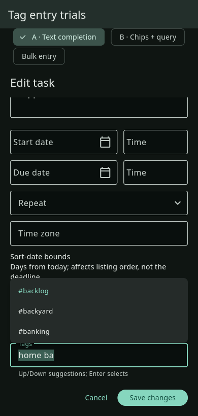
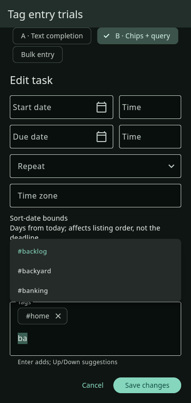
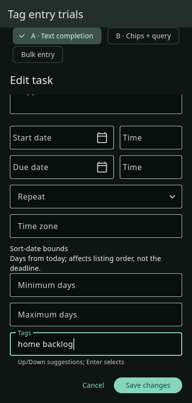
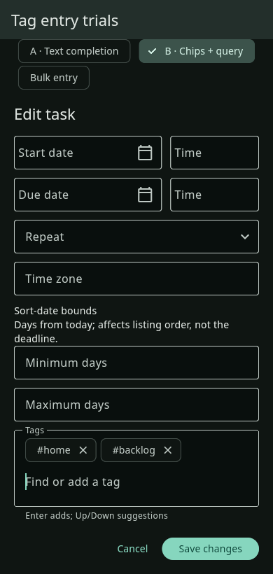

# Choose a tag-entry approach

Two lightweight alternatives, **awaiting Lee's choice**. Neither is connected to
the production host or adopted. Both use the actual Flutter task/bulk editor and
current theme with synthetic data; the harness opens no task store or profile.

| A — Text completion | B — Chips + query |
| --- | --- |
|  |  |
|  |  |
| Compact; type or paste tags as today. Complete the current tag with Up/Down and Enter, or click. | Clear selected set and explicit removal. Search, choose an existing tag, or Enter a new tag. Uses more height. |

These are **real Linux GTK debug captures**, dark theme, 100% text, with a desktop
window resized to 390 × 820. They are not Android or Windows acceptance.

[19-second pointer-visible Linux comparison](ui/tag-entry-linux-gtk-trials.mp4)
shows both alternatives at 1000 × 820, then the narrow window and bulk entry.
The pointer is visibly present in decoded footage at 6 seconds. The query is
staged as synthetic `ba`; desktop Enter and option/bulk switching use actual
X11 input. The upward popup overlaps earlier form fields in these trials.

Additional real captures:

- Desktop: [A suggestions](ui/a-1000-suggestions.png), [A selected](ui/a-1000-selected.png), [B suggestions](ui/b-1000-suggestions.png), [B selected](ui/b-1000-selected.png).
- Bulk: [A](ui/a-390-bulk.png), [B](ui/b-390-bulk.png).

All ten screenshots were inspected: labels, suggestions, query and editor actions
are readable/reachable, and there is no observed overflow. Root independently
reviewed the A/B narrow suggestions and desktop selected frames, finding the
compactness versus explicit-selection tradeoff clear. No winner was adopted.
The separately queued Sort-date spacing fix is not folded into these prototypes.

Lightweight checks: targeted analysis clean; one actual GTK smoke case passed in
12 seconds, exercising both choices at wide/narrow widths, keyboard suggestion
selection, chip selection/removal, new-tag entry, and bulk previews. The first
test input simulation omitted the TextInput submission action and failed; the
corrected native smoke passes. Native test-runner startup-frame captures were
rejected and replaced by standalone real-app pixels. See the [check log](native-smoke.txt).

Source/media SHA-256 and dimensions are in [manifest.json](manifest.json).
The source base is checklist candidate `eb68b46259f745e86ec9f41c144d473f19d0fb0f`.
The small opt-in editor hook is experimental; the production application host
never supplies it. The chosen production implementation, full tests and native
Android/Windows/large-text/IME/accessibility/persistence checks remain pending.

See [design and pending production checks](../../design/tag-autocomplete-trials.md).
